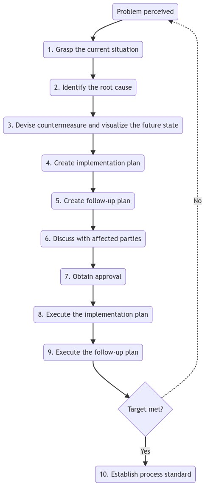

# Problem Solving using the A3 process

## Theme:

In order to be objective, the theme should focus on the observed problem and not advocate a particular solution

## Background:

- Is there a clear theme for the report that reflects the contents?
- Is the topic relevant to the organization's objectives?
- Is there any other reason for working on this topic (eg. learning purposes)?

## Current condition:

**Problem solving efforts fail in implementation most often because author(s) did not sufficiently understand the current condition** (rarely is failure due to incompetence of lack of ingenuity).

- Is the current condition clear and logically depicted in a visual manner?
- How could the current condition be made clear for the audience?
- Is the current condition depiction framing a problem or situation to be resolved?
- What is the actual problem in the current condition?
- Are the facts of the situation clear, or are there just observations and opinions?
- Is the problem quantified in some manner or is it too qualitative?

## Goal:

- Is there a clear goal or target?
- What, specifically, is to be accomplished?
- How will this goal be measured or evaluated?
- What will improve, by how much, and when?

## Root-cause analysis:

- Is the analysis comprehensive at a broad level?
- Is the analysis detailed enough and did it probe deeply on the right issues?
- Is there evidence of proper five-whys thinking about the true cause?
- Has cause and effect been demonstrated or linked in some manner?
- Are all the relevant factors considered (human, machine, material, method, environment, measurement, and so on)?

## Countermeasures:

- Are there clear countermeasure steps identified?
- Do the countermeasures link to the root cause of the problem?
- Are the countermeasures focused on the right areas?
- Who is responsible for doing what, by when (is 5W1H clear)?
- Will these action items prevent recurrence of the problem?
- Is the implementation order clear and reasonable?
- How will the effects of the countermeasures be verified?

## Check/Confirmation of Effect:

- How will you measure the effectiveness of the countermeasures?
- Does check item align with the previous goal statement?
- Has actual performance moved in line with the goal statement?
- If performance has not improved, then why? What was missed?

## Follow-up actions
- What is necessary to prevent recurrence of the problem?
- What remains to be accomplished?
- What other parts of the organization need to be informed of this result?
- How will this be standardized and communicated?

## Flow chart

## Reference

- [Understanding A3](https://www.goodreads.com/en/book/show/2614576-understanding-a3-thinking) by Durward K. Sobek II, Art Smalley